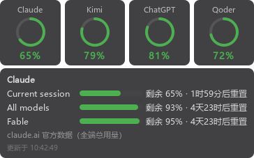

# llm-quota-bar — LLM 会员余量桌面悬浮条

Windows / macOS 桌面悬浮条 + 系统托盘，同屏监视多家 LLM **会员订阅配额 / 积分**的剩余量。



| 家 | 数据源 | 凭据 |
|---|---|---|
| Claude | `claude.ai` 官方 usage 接口（**全端总用量**：桌面 App / 网页 / CLI，含 Current session / All models / Fable 等分模型窗口）→ Claude Code statusline → OAuth usage API → 本地日志估算兜底；另附近 7 天分模型 token 分布 | cookie（见下）；CLI 路径全自动 |
| Kimi Code | `api.kimi.com/coding/v1/usages`（官方 CLI 同源端点） | 自动读 `~/.kimi-code/credentials/kimi-code.json`，过期自动刷新写回 |
| ChatGPT (Codex) | `chatgpt.com/backend-api/wham/usage`（Codex CLI 同款端点） | 自动读 `~/.codex/auth.json`，401 自动刷新写回 |
| Grok (SuperGrok) | `cli-chat-proxy.grok.com/v1/billing?format=credits`（订阅用量池周/月窗百分比，CodexBar 同款逆向）+ `/v1/settings` 取档位名 | 自动读 `~/.grok/auth.json`，过期自动刷新写回 |

Qoder CN 已暂停使用（2026-08-17 起）：`providers/qoder.py` 保留未删，恢复时在 `main.py` 里加回 import 与列表即可。

另有 `providers/qwen.py`（阿里云百炼 Coding Plan 控制台 RPC，含 sec_token 流程，链路已验证）：默认关闭，订阅了该套餐的话在 `config.local.toml` 的 `[qwen]` 里加 `enabled = true` 即可出现第五格。

## 安装与运行

```bash
git clone <repo-url>
cd llm-quota-bar
uv sync                          # 或 pip install PySide6 httpx
uv run python main.py            # 悬浮条 + 托盘
uv run python main.py --once     # 无界面抓一轮打印（调试用，不输出凭据）
```

Windows 下可直接双击 `启动悬浮条.bat`（无控制台窗口后台常驻）。开机自启：`Win+R` → `shell:startup` → 放入该 bat 的快捷方式。

macOS 下双击 `启动悬浮条.command`（注意改成你本机的实际路径）；首次打开若被 Gatekeeper 拦截，右键 → 打开。悬浮条在 macOS 上已适配失焦常驻（`WA_MacAlwaysShowToolWindow`），托盘气泡通知需系统通知权限。

## 界面

- 四格各显示一家**最紧张窗口的剩余百分比**，环形进度，绿 >50% / 橙 20–50% / 红 <20%。
- 拖动任意格子移动位置；**点击格子**展开/收起明细（各窗口余量、重置倒计时、附加信息、最后更新时间）。
- Kimi / ChatGPT 格明细带**订阅到期倒计时**（两家 2026-08-25 已关自动续费：Kimi 约至 2026-09-19、ChatGPT 约至 2026-09-17，以官网账号页为准；到期后显示"已停订"，接口报错时该行同样可见）。
- 数据超过 15 分钟未更新置灰；任一窗口用量 ≥80% 托盘气泡告警（回落到 70% 以下重置）。
- 托盘图标四象限对应四家颜色；右键菜单：立即刷新 / 暂停刷新 / 退出；左键点图标显隐悬浮条。

## 配置（`config.local.toml`，只存本机，已 gitignore）

```toml
# Claude：浏览器登录 claude.ai 后 F12 → Network → 刷新 → 任意请求 → 复制完整 Cookie 头
[claude]
cookie = '...'

# Grok：浏览器登录 grok.com，同样方法复制 Cookie 头（需含 cf_clearance）；
# 不配则 Grok 格只显示 CLI 登录态/账期兜底
# [grok]
# cookie = '...'

# 可选：Kimi Console API Key（不配则自动用 CLI 登录态）
# [kimi]
# api_key = "sk-kimi-..."   # https://www.kimi.com/code/console 里创建

# 可选：百炼 Coding Plan（默认关闭）
# [qwen]
# enabled = true
# cookie = '...'            # bailian.console.aliyun.com 的 Cookie 头
```

Cookie 失效后对应格子会提示"登录态失效"，重新复制即可；其余路径全自动维护。

## 凭据安全

- 各家 token 全部运行时现读各家 CLI 的本地凭据文件，不复制、不落盘、不打印。
- 刷新后的 token 原子写回原文件（临时文件 + os.replace），避免与 CLI 并发写冲突。
- 全部请求为只读 GET/查询，不发起任何模型推理调用。

## 已知限制与免责声明

- 除 Claude statusline / 本地日志外，各端点均为**未公开文档化、但社区广泛使用**的接口（参考 CodexBar、cc-switch、ccusage 的实现），可能随厂商调整失效——届时对应格子显示错误，不影响其他家。
- ChatGPT 的窗口语义随套餐变化（实测 Plus 只返回 7 天周窗），标签按窗口实际时长自动生成。
- Claude 本地估算为 token 口径（含 cache_read），与官方限额口径有出入；配了 claude.ai cookie 后即切换为官方全端口径。
- 本项目与 Anthropic、OpenAI、Moonshot、阿里巴巴无任何隶属关系，仅供个人用量自查，请遵守各平台服务条款。

## English

A Windows / macOS desktop floating bar + system tray that watches your remaining **subscription quotas** across LLM providers: Claude (claude.ai official usage, all surfaces incl. per-model weekly windows like Fable), Kimi Code (weekly + 5h windows), ChatGPT/Codex (rate-limit windows), and Grok/SuperGrok (weekly usage-pool window via the Grok CLI credits endpoint). Aliyun Bailian Coding Plan provider included but disabled by default; a dormant Qoder CN provider (`providers/qoder.py`) can be re-enabled in `main.py`.

- Per-provider cells show remaining % of the tightest window; click a cell for per-window details and reset countdowns; tray alerts at 80% usage.
- Credentials are read at runtime from each vendor's local CLI credential files (auto-refreshed and atomically written back); only Claude/Grok need a one-time browser cookie in `config.local.toml` (gitignored).
- All traffic is read-only usage queries — no inference calls. Endpoints are unofficial-but-widely-used (same ones as CodexBar/cc-switch); a failing endpoint only greys out its own cell.

Built with Python + PySide6, managed by uv. `python main.py --once` prints a credential-free summary for debugging.

## License

MIT
